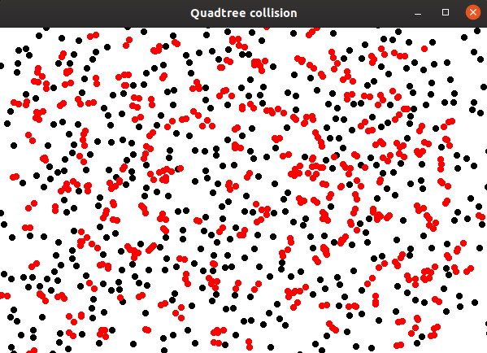

# 2D-collision-using-Quadtree

Algorithm for 2D collision(AABB) using Quadtree.
It's currently handling 1000 particles collision with 120FPS.

ps: some of the circles don't seem to collide because of the AABB algorithm... It's not very precise for cicles!
 

