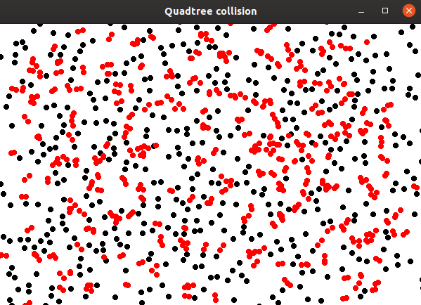

# 2D-collision-using-Quadtree

Algorithm for 2D collision (AABB) using a quadtree.
It's currently handling 1000 particles with about 120 FPS.

Requires SFML 3.1. Ubuntu 24.04 still packages SFML 2, so CMake fetches 3.1.0
from GitHub and builds the Graphics module.

```
cmake -S . -B build -G Ninja -DCMAKE_BUILD_TYPE=Release
cmake --build build
./build/quadtree
```

Linux needs the usual SFML window/graphics headers installed first:
`libxrandr-dev`, `libxcursor-dev`, `libxi-dev`, `libudev-dev`,
`libgl1-mesa-dev`, `libfreetype-dev`, and `libharfbuzz-dev`.

ps: some of the circles don't seem to collide because of the AABB algorithm... It's not very precise for cicles!
<br/>

